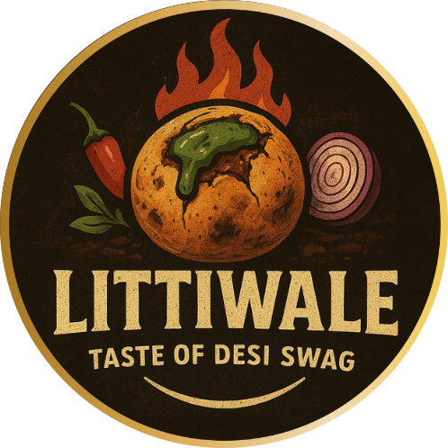

<div align="center">



# 🍛 Littiwale — Full Stack Web Platform

**India Ka Apna Desi Food Brand** · Cloud Kitchen + Physical Outlet

[](https://littiwale.vercel.app)
[](https://firebase.google.com)
[](https://vitejs.dev)

</div>

---

## 🌐 Live URLs

| Surface | URL |
|---|---|
| 🏠 Homepage | `https://littiwale.vercel.app/` |
| 🍽️ Menu | `https://littiwale.vercel.app/menu` |
| 🛒 Checkout | `https://littiwale.vercel.app/checkout` |
| 🔐 Admin Panel | `https://littiwale.vercel.app/admin` |
| 🏍️ Rider App | `https://littiwale.vercel.app/rider` |

---

## 🚀 Features

### Customer Side
- 📍 **Location Picker** — Cloud Kitchen vs Physical Outlet toggle with veg-only filter
- 🍽️ **Live Menu** — Category-wise, filtered by location, with variants & bestseller badges
- 🛒 **Cart & Checkout** — Coupon support, real-time order placement
- 📦 **Order Tracking** — Live status updates via Firestore `onSnapshot`
- 🎫 **Support Tickets** — Raise complaints, chat with admin in real-time
- 📢 **Announcements Carousel** — Admin-controlled banners, auto aspect-ratio fit

### Admin Panel (`/admin`)
- 📊 **Dashboard** — Orders, revenue, top items, customer analytics
- 🧾 **Order Management** — Accept, dispatch, complete orders; assign riders
- 🍱 **Menu Management** — Add/edit/delete items with image upload (Firestore base64)
- 🎟️ **Coupon Engine** — Percentage, flat, freebie, combo, special-price coupon types
- 👥 **Customer Management** — View customer profiles and order history
- 📢 **Announcements** — Upload banners, drag-to-reorder carousel, hide/publish/delete
- 🎫 **Support Tickets** — Reply to customer complaints, resolve/close tickets
- 🏍️ **Rider Management** — Assign, track, and manage delivery riders

### Rider App (`/rider`)
- 📲 Real-time order assignments
- 📍 Live location tracking
- ✅ Delivery confirmation flow

---

## 🛠️ Tech Stack

| Layer | Technology |
|---|---|
| Frontend | Vanilla JS, HTML5, CSS3 |
| Build Tool | Vite 6 |
| Backend | Firebase Firestore (real-time) |
| Auth | Firebase Authentication |
| Image Storage | Firestore base64 (no Storage bucket needed) |
| Hosting | Vercel (frontend) + Firebase (Firestore/Auth) |
| Payments | COD (Cash on Delivery) |

---

## 📁 Project Structure

```
Littiwale-Website-main/
├── index.html              # Homepage
├── login.html              # Admin/Rider login
├── admin/
│   └── index.html          # Admin panel shell
├── customer/
│   ├── index.html          # Customer homepage
│   ├── menu.html           # Menu page
│   └── track.html          # Order tracking
├── rider/
│   └── index.html          # Rider app
├── src/
│   ├── admin.js            # Admin panel logic
│   ├── main.js             # Customer homepage logic
│   ├── menu.js             # Menu page logic
│   ├── profile-modal.js    # Customer ticket/profile modal
│   ├── style.css           # Global styles
│   ├── api/
│   │   ├── announcements.js
│   │   ├── auth.js
│   │   ├── menu.js
│   │   ├── orders.js
│   │   ├── tickets.js
│   │   └── ...
│   └── firebase/
│       └── config.js       # Firebase init
├── public/
│   └── images/             # Static assets
├── firebase.json           # Firebase hosting config
├── firestore.rules         # Firestore security rules
├── firestore.indexes.json  # Composite indexes
├── vercel.json             # Vercel routing config
└── vite.config.js          # Vite build config
```

---

## ⚙️ Local Development Setup

### 1. Clone & Install

```bash
git clone https://github.com/Littiwale/LittiwaleFullStack.git
cd LittiwaleFullStack
npm install
```

### 2. Environment Variables

Copy `.env.example` to `.env` and fill in your Firebase credentials:

```bash
cp .env.example .env
```

```env
VITE_FIREBASE_API_KEY=your_api_key
VITE_FIREBASE_AUTH_DOMAIN=your_project.firebaseapp.com
VITE_FIREBASE_PROJECT_ID=your_project_id
VITE_FIREBASE_STORAGE_BUCKET=your_project.firebasestorage.app
VITE_FIREBASE_MESSAGING_SENDER_ID=your_sender_id
VITE_FIREBASE_APP_ID=your_app_id
```

### 3. Run Dev Server

```bash
npm run dev
```

Open `http://localhost:9001`

### 4. Build for Production

```bash
npm run build
```

---

## 🔐 Firestore Security Rules

Rules are in `firestore.rules`. Key points:
- Customers can only read/write their own orders and tickets
- Admin functions require `admin: true` in user profile
- Riders can update order status only for assigned orders
- Announcements and menu are publicly readable

---

## 🚢 Deployment

### Deploy to Vercel
```bash
git push origin main
# Vercel auto-deploys on push via GitHub integration
```

### Deploy Firestore Rules
```bash
npx firebase-tools deploy --only firestore:rules,firestore:indexes --project littiwale-90990
```

---

## 📝 Environment Notes

- **Image Storage**: This project stores images as compressed base64 strings directly in Firestore documents (no Firebase Storage bucket required — works on free Spark plan)
- **Announcements**: Admin can upload landscape banner images; they auto-compress to max 1200px wide, JPEG 72% quality
- **Menu Images**: Auto-compress to max 900px wide, JPEG 75% quality

---

## 👨‍💻 Developed By

<div align="center">

**[Brandnest](https://brandnestagency.vercel.app)** — India's First AI-Powered Digital Agency

*Crafting digital experiences that convert*

</div>
